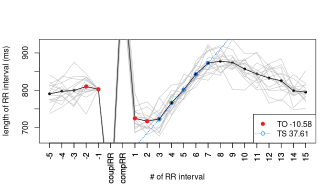

<!-- README.md is generated from README.Rmd. Please edit that file -->

# RHRT

RHRT provides tools for a Heart Rate Turbulence analysis of RR interval
data. It can either find the ventricular premature complexes (VPCs) via
a set of filter rules or can use annotation data to only check the beats
with the correct annotation. VPC snippets are filtered for validity and
HRT parameters calculated.

In addition to standard calculation methods the package allows to modify
the filter and calculation parameters. It is therefore not only helpful
to identify HRT classes of measurements for risk assessment but also for
assessment of the methodology itself.

For more information please check the vignette of the package. For more
information about HRT have a look into the [original publication by
Schmidt et al.](https://doi.org/10.1016/S0140-6736(98)08428-1) or our
[review](https://doi.org/10.1088/1361-6579/ab98b3) with focus on the
methodology.

## Installation

You can install the released version of RHRT from
[CRAN](https://CRAN.R-project.org) with:

``` r
install.packages("RHRT")
```

And the development version from [GitHub](https://github.com/) with:

``` r
install.packages("devtools") # if not already done
devtools::install_github("VBlesius/RHRT/RHRT")
```

## Example

The general workflow of RHRT is to scan your interval data for HRT and
check the results via HRT class and plot:

``` r
library(RHRT)
## scan your interval data and save the results as an HRTList
hrtl <- vectorToHRT(testdataLong)
## get the HRT class of your data
getResults(hrtl, type = "class")
#> [1] "HRT0"
## have a look at the data and the parameters
plot(hrtl)
```



## Data

Data to test the package can be found on
[Physionet](https://physionet.org/). Via the [WFDB
Toolkit](https://physionet.org/content/wfdb/10.6.2/) ECG data can be
downloaded and/or converted, for example:

``` bash
ann2rr -r chf2db/chf201 -a ecg -i s3 -w > ~/some/path/chf201.csv
```

Then load the data and use RHRT to find VPCSs:

``` r
chf201 <- read.table("~/some/path/chf201.csv")
hrtl <- RHRT::vectorToHRT(chf201[[1]]*1000, ann = chf201[[2]])
```

More example workflows can be found in the vignette.
