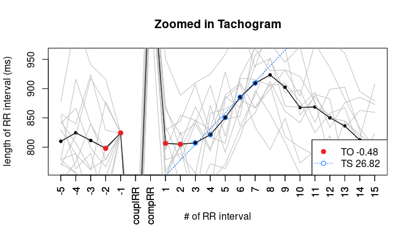
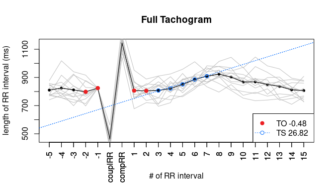
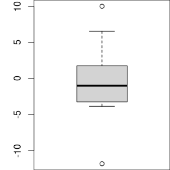
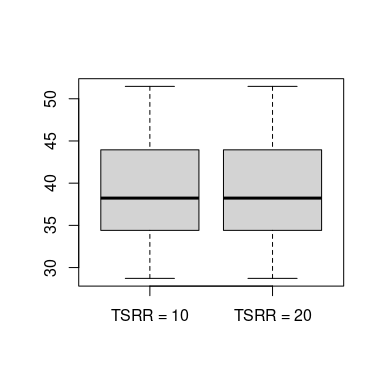

--------

## Determining the HRT class of a person

The main focus of the package is to determine the HRT parameters or class of a person by a long-term ECG measurement. Load the data as a numeric vector and use `vectorToHRT` to find HRTs, then `getResults` and `plot` to check the results:


```r
library("RHRT")
hrtl <- vectorToHRT(testdataLong) # create the HRTList
getResults(hrtl) # get the averaged HRT parameters
```

```
## [1] "HRT0"
```

```r
plot(hrtl) # plot the HRTs and check the variability
```

<!-- -->

The results do not pass the reliability check so we get "NR" as HRT class. The plot shows that firstly TO is near to zero and secondly there is a high variability in the VPCSs. We can go deeper into the data by checking the exact parameters (including TT as an additional hint to the person's status) and zooming out of the plot:


```r
round(
  getResults(hrtl, "full", TT = TRUE),
digits = 2) # get the parameters and p-values of the variability check
```

```
##     TO     TS     TT    pTO    pTS    pTT 
## -10.58  37.61   3.00   0.00   0.00   0.00
```

```r
plot(hrtl, cropped = FALSE) # plot the full VPCSs
```

<!-- -->

As expected TO is not reliable with a p-value over 0.05. The VPCSs still seem to fluctuate a lot with the first two postRRs that determine TO varying above and below the ones of the avHRT. We can can get a picture on all TO values by using `getHRTParams`:


```r
tos <- getHRTParams(hrtl, "TO")
tos
```

```
##  [1] -12.264829  -6.349883 -11.856998  -9.011983 -13.733660 -10.859878
##  [7] -10.357064 -13.174994 -12.743754  -8.427299 -11.495815  -8.892588
## [13] -11.795365  -6.502960 -11.165541
```

```r
summary(tos)
```

```
##    Min. 1st Qu.  Median    Mean 3rd Qu.    Max. 
## -13.734 -12.061 -11.166 -10.576  -8.952  -6.350
```

```r
boxplot(tos)
```

<!-- -->

These results can help to come to a well-founded decision on whether to classify the patient as HRT0/HRTA and trust the TO value or rather classify them conservatively as HRT1/HRTB. 

## Comparing HRT results with different methodological parameters

This is an example how the package can be used to analyse the HRT methodology. Due to data size we use a set of HRTs of one person rather than a set of averaged HRTs. For example, we can compare the difference in `TS` values when using different `numPostRRs`.


```r
library("RHRT")
hrtl10 <- getHRTParams(vectorToHRT(testdataLong, numPostRRs = 10), "TS")
hrtl20 <- getHRTParams(vectorToHRT(testdataLong, numPostRRs = 20), "TS")
boxplot(hrtl10, hrtl20, names = c("TSRR = 10", "TSRR = 20"))
```

<!-- -->

```r
t.test(hrtl10, hrtl20)
```

```
## 
## 	Welch Two Sample t-test
## 
## data:  hrtl10 and hrtl20
## t = 0, df = 28, p-value = 1
## alternative hypothesis: true difference in means is not equal to 0
## 95 percent confidence interval:
##  -5.116392  5.116392
## sample estimates:
## mean of x mean of y 
##  39.36397  39.36397
```

--------

Further information can be found in the other vignettes: [synopsis](synopsis.html), [objects & functions](objects_functions.html) and [scientific background](background.html).

<!---
# Part of RHRT: R package to assess Heart Rate Turbulence from RR interval data 
# Copyright (C) 2021 Valeria Blesius

# RHRT is free software: you can redistribute it and/or modify
# it under the terms of the GNU General Public License as published by
# the Free Software Foundation, version 2 only.

# RHRT is distributed in the hope that it will be useful,
# but WITHOUT ANY WARRANTY; without even the implied warranty of
# MERCHANTABILITY or FITNESS FOR A PARTICULAR PURPOSE.  See the
# GNU General Public License for more details.

# You should have received a copy of the GNU General Public License
# along with RHRT.  If not, see <https://www.gnu.org/licenses/>.
-->
